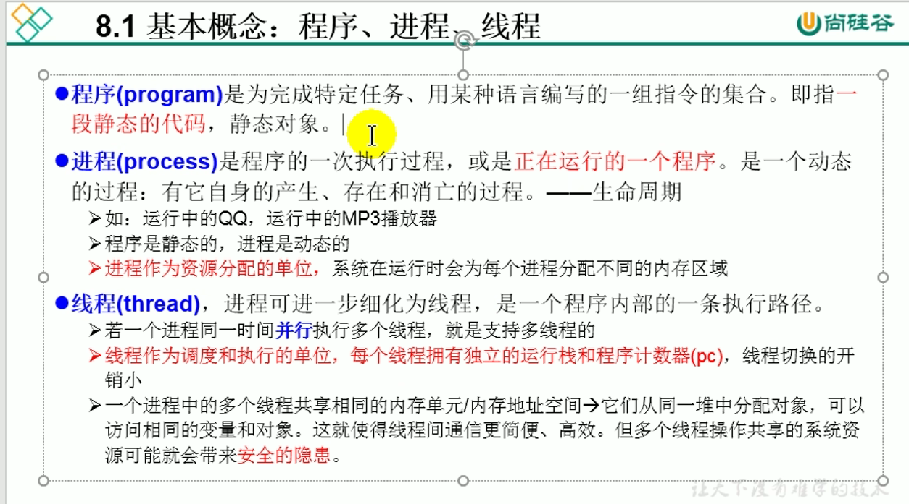
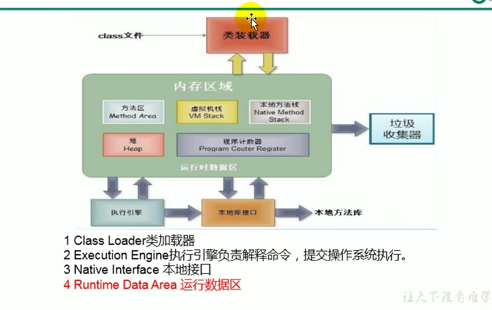
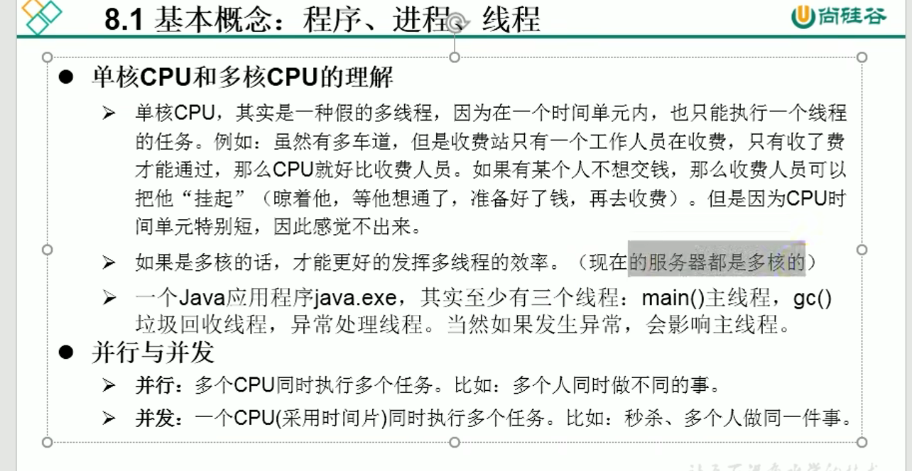
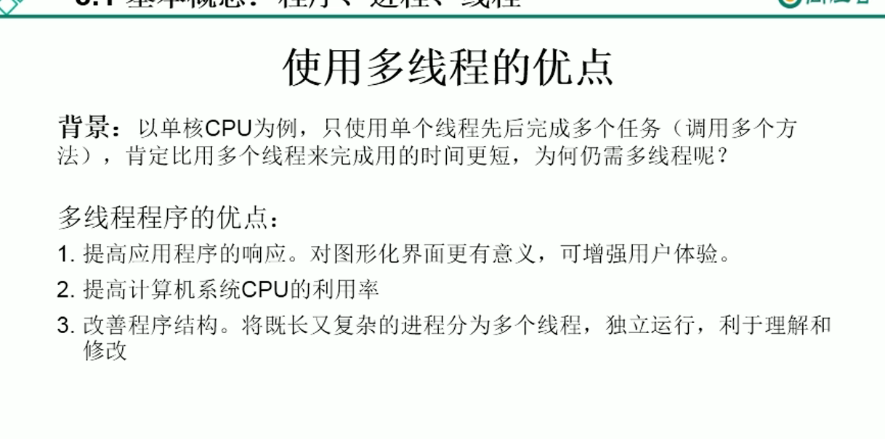

## 内存结构

---

---

### 何时需要多线程
1. 程序需要同时执行两个或多个任务
2. 程序需要实现一些需要等待的任务，如用户输入、文件读写操作、网络操作、搜索等
3. 需要一些后台运行的程序时

## 8.2 Thread常用方法
1. start():启动当前线程，调用当前线程的run()
2. run(): 通常需要重写Thread类的方法，将创建的线程要执行的操作生命在此方法中
3. currentThread():静态方法，返回执行当前代码的线程
4. getName():获取当前线程的名字
5. setName():设置当前线程的名字
6. yidle():释放当前cpu的执行权
7. join():在线程a中调用线程b的join(),此时线程a就进入阻塞状态，知道线程b完全执行完以后，线程a才结束阻塞状态
8. stop():已过时，当执行此方法时，强制结束当前线程